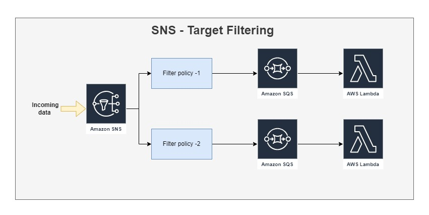

---

I**ntroduction:**
The serverless paradigm has revolutionized the way we build and deploy applications. AWS Lambda, a leading serverless compute service, allows developers to run code without provisioning or managing servers. Amazon Simple Notification Service (SNS) complements Lambda by providing a messaging service to decouple and distribute events. In this blog post, we'll explore how to create a powerful combination of AWS SNS and Lambda using filter policies.

Filter Policies: The Power of Selective Event Routing
Filter policies in SNS play a vital role in selectively routing messages to subscribing services, such as Lambda functions. With filter policies, you can ensure that your Lambda functions are triggered only by the specific events that matter to them, reducing unnecessary processing and improving efficiency.

### **The Anatomy of an AWS SNS Filter Policy**

A filter policy is essentially a set of rules that you define to filter messages based on their attributes. These attributes can be part of the message payload. Here's the basic structure of an AWS SNS filter policy:

```json
json {   "attribute_name": ["value1", "value2"],   "numeric_attribute": [{"numeric": [">", 10]}, {"numeric": ["<=", 100]}] }
```

### In the above example:

- **`"attribute_name"`**: The filter policy checks if the **`attribute_name`** attribute has either **`value1`** or **`value2`**.
- **`"numeric_attribute"`**: This filter policy specifies that the **`numeric_attribute`** should be numeric and have a value greater than 10 and less than or equal to 100.

### **Use Cases for Filter Policies**

1. **Event Type Filtering**: You can use filter policies to filter messages based on specific event types. For example, if you have different types of events coming into your SNS topic, you can use a filter policy to ensure that your Lambda function is only triggered by events of a certain type. This can help keep your Lambda functions focused and efficient.
2. **Value-Based Filtering**: Filter policies are not limited to event types. You can also filter messages based on specific attribute values. For instance, you can filter out messages with a low priority, only processing those with values that meet a certain threshold.
3. **Combination Filters**: Advanced use cases involve combining multiple filters. For example, you can filter messages based on both event type and attribute values, providing fine-grained control over which messages trigger your Lambda functions.

### **How to Implement Filter Policies**

To implement filter policies in your AWS SNS setup, follow these steps:

1. **Create an SNS Topic**: First, create an SNS topic that will serve as the central hub for your events.
2. **Define the Filter Policy**: When creating an SNS subscription, you can define the filter policy. It's a JSON object that specifies the filtering rules based on your requirements.
3. **Subscribe Lambda Functions**: Subscribe your AWS Lambda functions to the SNS topic. The filter policy you defined will ensure that the Lambda functions receive only the messages that match the criteria you specified.

### **Benefits of Using Filter Policies**

1. **Resource Efficiency**: By using filter policies, you can reduce the processing load on your Lambda functions. They will only execute when relevant events are sent to the SNS topic, conserving resources and reducing costs.
2. **Improved Scalability**: Selective event processing enables you to scale your Lambda functions more effectively. They don't need to process irrelevant events, allowing them to handle more important workloads.
3. **Fine-Grained Control**: Filter policies give you fine-grained control over which events trigger your Lambda functions, ensuring that you respond to the right events at the right time.
4. **Enhanced Security**: With filter policies, you can restrict access to specific types of data, ensuring that sensitive information is only processed by authorized Lambda functions.

### **Real-World Applications**

1. **E-commerce**: In an e-commerce platform, you can use filter policies to route order placement events to a Lambda function responsible for order processing, while shipping events are routed to another function that manages shipping logistics.
2. **IoT**: In an Internet of Things (IoT) application, you can filter sensor data based on specific sensor IDs and data thresholds. This ensures that only critical sensor events trigger your Lambda functions.

### **Conclusion**

Filter policies in AWS SNS offer a powerful way to optimize event processing in a serverless architecture. By using filter policies, you can gain granular control over which events trigger your Lambda functions, improve resource efficiency, and enhance the scalability and security of your serverless applications.

In summary, filter policies are a crucial tool in your serverless toolkit, allowing you to make your event-driven applications smarter, more efficient, and more responsive to your specific needs. Leveraging the power of AWS SNS filter policies can lead to significant improvements in the performance and cost-effectiveness of your serverless architecture.
